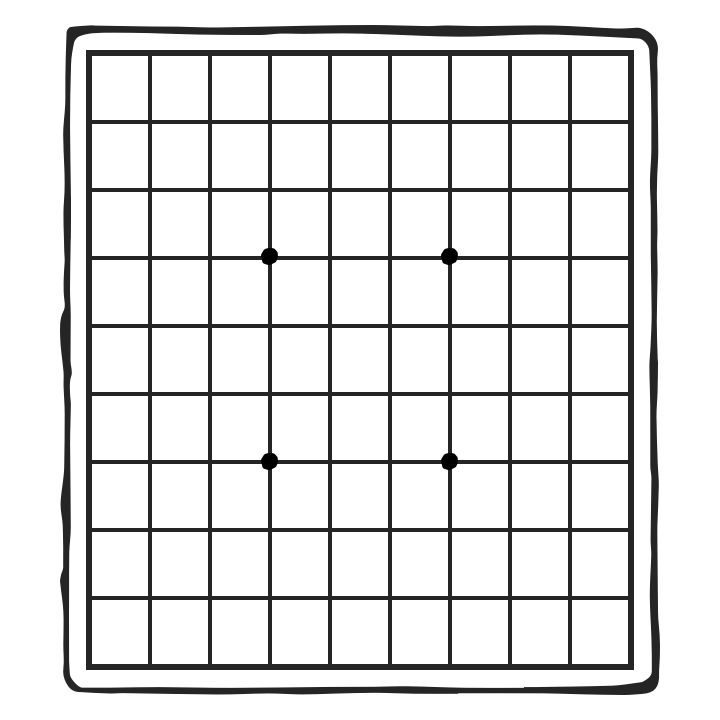
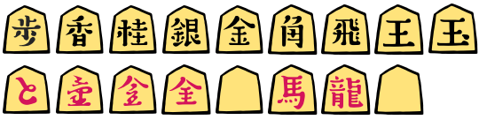
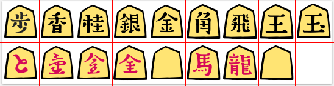
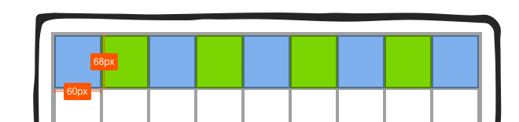

# 将棋素材

将棋盤と駒の画像素材です。
[CC BY 2.1 JP](https://creativecommons.org/licenses/by/2.1/jp/) の下で自由に利用できます(後述)。

## 素材

[board.png](./board.png) - 将棋盤素材(720x720):

[piece.png](./piece.png) - 将棋駒素材(540x136):

## 説明

駒一つのサイズは 60x68 ピクセルです。

盤は左上のマス(９一)の座標が (90, 54) で、一マスの大きさが 60x68 ピクセルです。

## ライセンス

このディレクトリ以下の画像ファイルは <a rel="license" href="http://creativecommons.org/licenses/by/2.1/jp/">クリエイティブ・コモンズ 表示 2.1 日本 ライセンス</a> の下に提供されています。

Copyright (c) 2018 DWANGO Co., Ltd.
